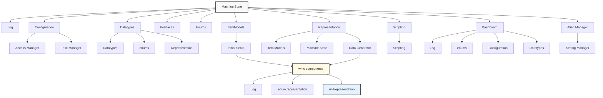

# System Architecture Diagram

```mermaid
graph TD
    MS["Machine State"]
    
    MS --> Log
    MS --> Config["Configuration"]
    MS --> Datatypes
    MS --> Interfaces
    MS --> Enums
    MS --> ItemModels
    MS --> Representation
    MS --> Scripting
    MS --> Dashboard
    MS --> AlienManager["Alien Manager"]
    
    Config --> AccessManager["Access Manager"]
    Config --> TaskManager["Task Manager"]
    
    Datatypes --> DT_Log["Datatypes"]
    Datatypes --> DT_Enums["enums"]
    Datatypes --> DT_Representation["Representation"]
    
    Representation --> Rep_ItemModels["Item Models"]
    Representation --> Rep_MachineState["Machine State"]
    Representation --> DataGenerator["Data Generator"]
    
    ItemModels --> InitialSetup["Initial Setup"]
    
    Scripting --> Scr_Scripting["Scripting"]
    
    Dashboard --> DB_Log["Log"]
    Dashboard --> DB_Enums["enums"]
    Dashboard --> DB_Config["Configuration"]
    Dashboard --> DB_Datatypes["Datatypes"]
    
    AlienManager --> SettingManager["Setting Manager"]
    
    InitialSetup --> WMC["wmc components"]
    
    WMC --> WMC_Log["Log"]
    WMC --> WMC_EnumRep["enum representation"]
    WMC --> UnitRep["unitrepresentation"]
    
    DataGenerator --> WMC
    
    style MS fill:#f9f9f9,stroke:#333,stroke-width:2px
    style WMC fill:#fff9e6,stroke:#333,stroke-width:2px
    style UnitRep fill:#e6f3ff,stroke:#333,stroke-width:2px
```
